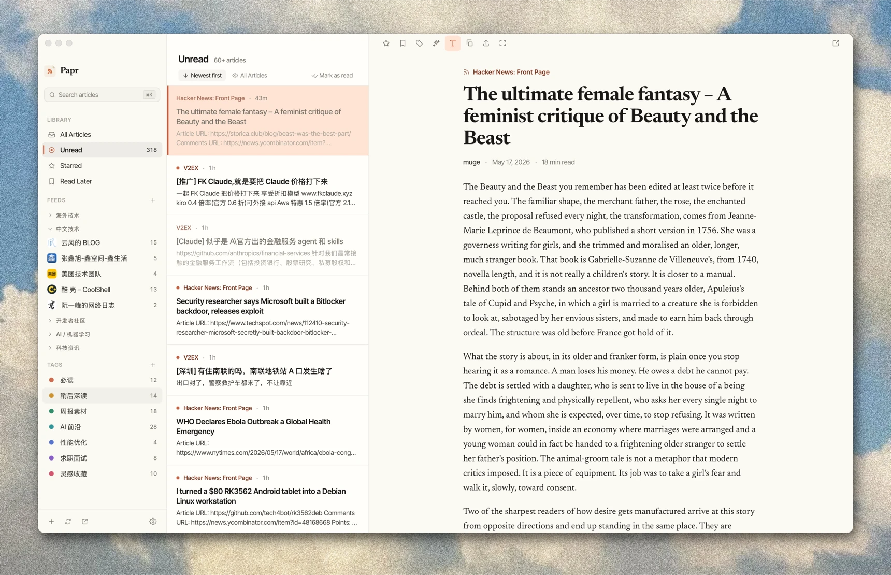

# Papr

A fast, native RSS reader for the desktop.

## Features

- **Feeds & folders** — subscribe, organize, and import/export OPML.
- **Smart views** — All, Unread, Starred, and Read Later, with live counts.
- **Tags & rules** — color-coded tags and rules that tag new articles automatically.
- **Full-text** — fetch and clean the complete article when a feed ships only a summary.
- **AI** — summaries, ask-the-article Q&A, and digests. Bring your own API key.
- **Audio** — a built-in player that follows you from article to article.
- **FreshRSS sync** — keep read state in step with a FreshRSS server.
- **Local-first** — everything in a local SQLite database. No account, no cloud.
- **Localized** — English, Japanese, and Simplified Chinese.

## Installation

Download the installer for your platform from the [latest release](https://github.com/l0ng-ai/papr/releases/latest).
