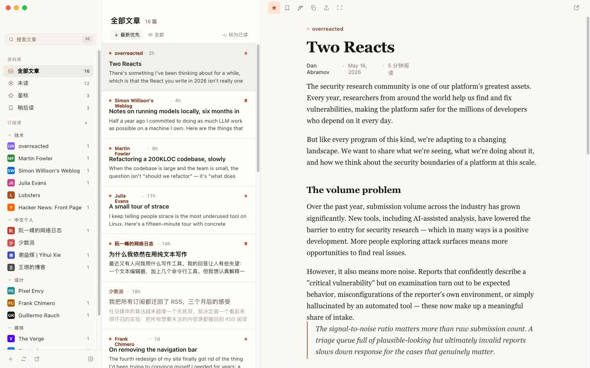

# Papr

**Your reading, gathered in one quiet place.**

A native desktop RSS reader for people who still believe the web is worth
following closely — without the noise, the accounts, or the algorithm.

 

---

## A calmer way to read the web

Papr is an RSS reader that brings every site, blog, and publication you
care about into a single unhurried space. No feed ranking you'll never
understand, no inbox guilt — just the writing you chose, presented the way
it deserves to be read.

Everything lives on your own machine. There is no account to create and
nothing to sign in to. Your reading is yours.

## What you can do

### Follow what matters
Subscribe to any site with a feed, organise your sources into folders, and
move things around until the shelf feels right. Bringing a library over
from another reader takes one OPML file.

### Read, not skim
Articles that arrive as a thin summary are quietly upgraded to the full
piece — automatically as you open them, or on a single click. Pages are
cleaned of clutter and laid out for comfort, with a typography and width
you control.

### Stay on top of it
All, Unread, Starred, and Read Later — each view counts itself so you
always know where you stand. Star what you love, set aside what deserves
a second pass.

### Make it your own
Colour-coded tags keep themes together, and smart rules tag new articles
the moment they arrive — so the work of sorting happens before you ever
look.

### Ask, summarise, digest
A built-in assistant can distil a long article to its essence, answer
questions about what you're reading, and round up the day into a digest —
all streamed as it's written. Bring your own provider; nothing leaves
your machine without you.

### Listen instead
Hand an article to the audio player and keep reading — or keep walking.
Playback follows you from piece to piece.

### Built for the desktop
A tray icon carries your unread count, notifications let you know when
something lands, and Papr can be there waiting the moment you log in.
The window remembers exactly where you left it.

### In your language
Fully localised in English, Japanese, and Simplified Chinese.

---

*Papr — the web, on your terms.*

